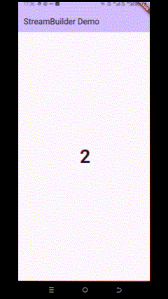

# streambuilder_fadhlan

A new Flutter project.

## Getting Started

This project is a starting point for a Flutter application.

A few resources to get you started if this is your first Flutter project:

- [Lab: Write your first Flutter app](https://docs.flutter.dev/get-started/codelab)
- [Cookbook: Useful Flutter samples](https://docs.flutter.dev/cookbook)

For help getting started with Flutter development, view the
[online documentation](https://docs.flutter.dev/), which offers tutorials,
samples, guidance on mobile development, and a full API reference.

## Display
### Praktikum 6
#### <u>Soal 12</u>
- Langkah 3 (class NumberStream), merupakan struktur stream yang menghasilkan angka acak dari 0 hingga 9 secara terus-menerus, dengan interval setiap 1 detik. Stream ini menggunakan Stream.periodic untuk menghasilkan data secara periodik dan yield* untuk meneruskan seluruh hasilnya ke stream utama.
- Langkah 7 (StreamBuilder atau listen) merupakan penutup dari blok yang membangun UI. Ketika menggunakan StreamBuilder, maka UI akan secara otomatis membangun ulang (rebuild) setiap kali data baru diterima dari stream. Artinya, setiap kali ada perubahan data dari stream, UI akan langsung ikut berubah atau diperbarui.

    